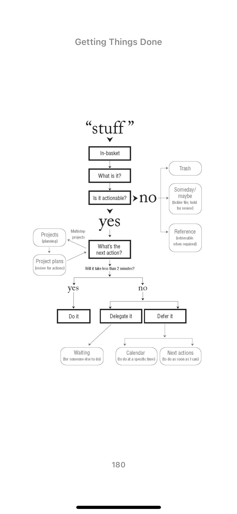
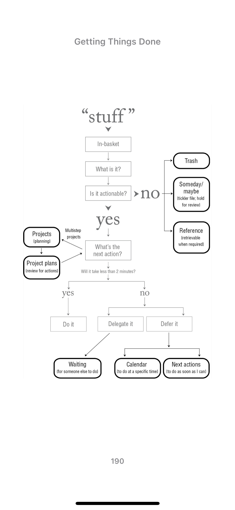
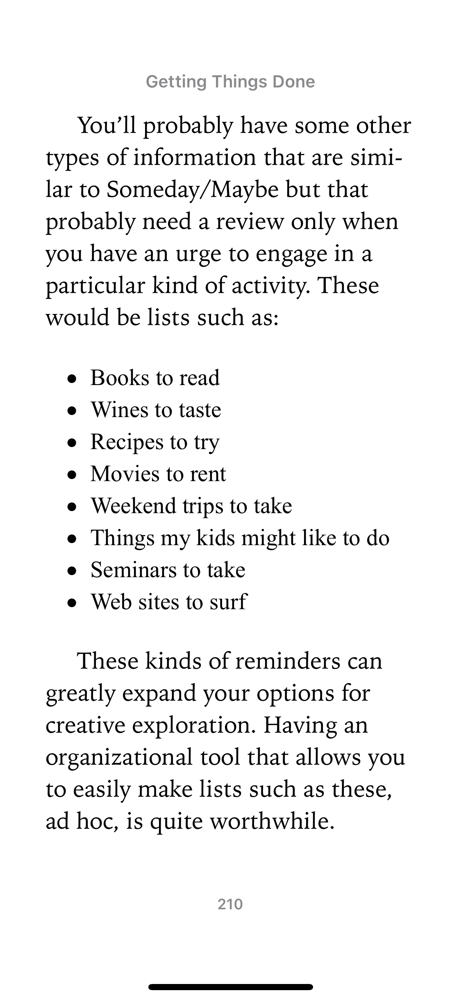

# GTD

### Graphics

Here, bolded boxes are the lists you need:

## Notes

- As few “in” trays as possible
  - Increases likelihood you’ll follow it
  - Adds to integrity
- Process in tray regularly
  - Doesn’t mention how frequently yet
- “Do it if less than 2 minutes rule” applies during the clarifying step — so when the action is “defined”
- Need a “list of projects” AND “storage or files of project plans”
- Project definition
  - Accomplished within a year
  - More than one action
  - Can be considered as “done”
    - Does this mean “dot files” isn’t a project? Or is “finish baseline dot files” a project
- Purge reference consistently
  - Recurring reminders to clear out chrome bookmarks and reference? (Google drive)
- What goes on calendar
  - Daytime specific actions (appointments)
  - Day specific actions (things that need to be done on that day)
  - Day specific info
- Review Someday weekly

## Links
